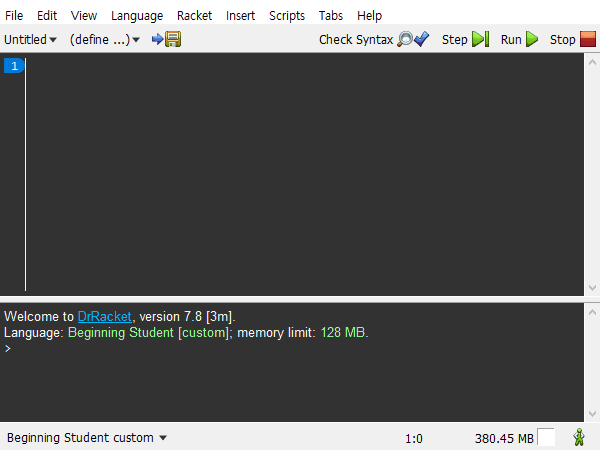
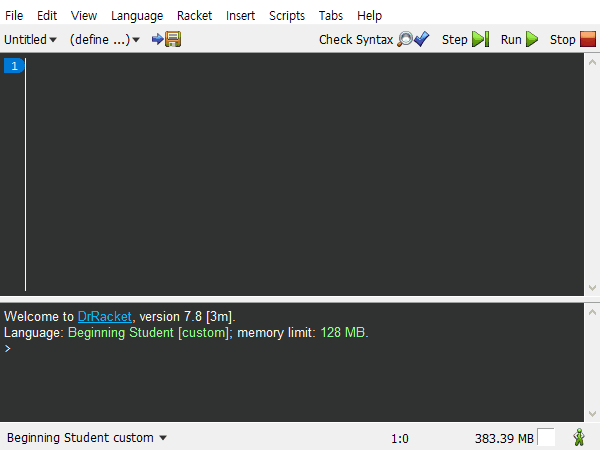
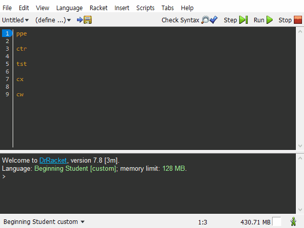

# CS 135 DrTools
DrRacket Tools for CS 135 course at UWaterloo

## Disclaimers
- **The authors are NOT responsible for any issues using any part of this repository will cause you. ALWAYS back up your files, preferences and code!**
- **Though it may not be necessary in all cases, DrRacket should be restarted after most customizations to allow all changes to take effect.**

## Acknowledgements
- Autocomplete was adapted from *complete-word* in [Quickscript Extra](https://github.com/Metaxal/quickscript-extra)
- Keybindings was adapted from [Racket-lang.org](https://docs.racket-lang.org/drracket/Keyboard_Shortcuts.html#%28part._defining-shortcuts%29) documentation

### Contributors
- Creator and Maintainer: [Raymond Li](https://github.com/Raymo111) ([https://Raymond.Li](https://raymond.li))
- Co-creator and Maintainer: [Kaustubh Prabhakar](https://github.com/SantaKaus) ([https://KaustubhPrabhakar.tech](https://kaustubhprabhakar.tech))
- Contributor: [Thomas Park](https://github.com/ThomasPark20)

## Installation
There are 2 parts of this package that you can install. By following the steps below, you will get autocomplete and additional keybindings. To install the preferences, follow the installation section under [Racket Preferences](#installation-1). Default Racket keybindings will continue to work after installation.
1. Go to `File > Install Package...` from the menubar.
2. Put `cs135-drtools` in the input field beside `Package Source:`, and click `Install`.
4. Restart DrRacket.

## Tools
### Autocomplete
- Completion for the following:

| Shortcut | Generates               |
|----------|-------------------------|
| cx       | check-expect            |
| cw       | check-within            |
| ce       | check-error             |
| df       | define function         |
| d        | define                  |
| t        | true                    |
| f        | false                   |
| hdr      | file header             |
| cmt      | comment                 |
| l        | `;;   `                 |
| ll       | 3-line comment          |
| pa       | 3-line "Part a" comment |
| pb       | 3-line "Part b" comment |
| pc       | 3-line "Part c" comment |
| pd       | 3-line "Part d" comment |
| ppe      | Purpose and examples    |
| ctr      | Contract                |
| req      | Requires                |
| tst      | Tests                   |
| lox      | list-of-X Template      |
| nelox    | ne-List-of-X Template   |
| lo       | (listof )               |
| nelo     | (ne-listof )            |
| lost     | (listof Str)            |
| nelost   | (ne-listof Str)         |
| lob      | (listof Bool)           |
| nelob    | (ne-listof Bool)        |
| loc      | (listof Char)           |
| neloc    | (ne-listof Char)        |
| losy     | (listof Sym)            |
| nelosy   | (ne-listof Sym)         |
| lonu     | (listof Num)            |
| nelonu   | (ne-listof Num)         |
| lona     | (listof Nat)            |
| nelona   | (ne-listof Nat)         |

- `Ctrl+Space` trigger (**Will NOT work in comments!**) just hit enter and remove the newline after completion, we're working on making these work in comments)

#### Usage:
1. Type a shortcut
2. Press `Ctrl+Space`
3. The shortcut will be replaced with generated code

### Keybindings
- Works out of the box after installing the package
- **Note: No commonly-used original keybindings are overwritten.** (i.e. The DrRacket default keybindings still do what they used to. This package simply adds more.)
- Provides the following keybindings:

| Keybinding     | What it does                                      | DrRacket default |
|----------------|---------------------------------------------------|------------------|
| Alt+R          | Run the program                                   | Ctrl+R or F5     |
| Ctrl+Shift+F   | Indent all lines                                  | Ctrl+I           |
| Ctrl+H         | Show Replace                                      | Ctrl+Shift+R     |
| Ctrl+Shift+R   | Replace All                                       | *None*           |
| Ctrl+/         | Comment out line with `;`                         | *None*           |
| Ctrl+Backspace | Delete word left of cursor                        | Alt+Backspace    |
| Ctrl+Delete    | Delete word right of cursor                       | Alt+Delete       |
| Alt+Up/Down    | Switch between Interactions and Definitions panes | Ctrl+F6          |

<!--
| Up             | Previous command in Interactions panes            | Ctrl+up          |
| Down           | Next command in Interactions panes                | Ctrl+down        |
Known issue:
Up/Down messes up multi-line inputs in the interactions window. I've chosen to leave this in because multiline interactions input that needs to be edited is uncommon and can simply be navigated via a mouse or Ctrl+Left/Right, whereas the terminal/shell/console-like up for previous command is used more often. Users that are unused to this or require multiline interactions input navigation can comment out the last two lines of the file, while I come up with a better way to implement this.
-->

### Racket Preferences
<!--- **Note: Your preferences will NOT be overwritten upon installing this package, as long as you don't follow the installation instructions below.**-->
- Dark mode based on [Monokai v2.1](http://www.eclipsecolorthemes.org/?view=theme&id=52794)
- `[` (left square bracket) will automatically determine the right bracket for you (no need to `Shift+9` anymore!) and insert a close bracket for you as well
- In addition to the notable ones mentioned here, all the features we found useful have been enabled. The default language for new files is set to `Beginning Student Custom`, the starting language for CS 135 at UWaterloo. This may change as we progress through the course, or it may not.

#### Installation
- **!Important! BACK UP your existing preferences file FIRST, just in case you don't like ours.**
- Unix: Download [`racket-prefs.rktd`](https://raw.githubusercontent.com/Raymo111/cs135-drtools/master/racket-prefs.rktd) to `$HOME/.racket` and reload DrRacket
- Windows: Download [`racket-prefs.rktd`](https://raw.githubusercontent.com/Raymo111/cs135-drtools/master/racket-prefs.rktd) to `%appdata%\Racket` (paste that into the File Explorer location bar and hit enter) and reload DrRacket
- Mac OS: Download [`racket-prefs.rktd`](https://raw.githubusercontent.com/Raymo111/cs135-drtools/master/racket-prefs.rktd) to your preferences folder, rename the file to `org.racket-lang.prefs.rktd`, and reload DrRacket

### Additional Tips
Installing the `drcomplete` raco package (**not part of this package**) will provide automated completion of variables and functions. You can install `drcomplete` the same way you installed `cs135-drtools`. After restarting DrRacket, click `Edit > Enable Automatic Autocompletion` (last item) in the menubar to enable it, if it isn't already enabled.

<!-- hitwebcounter Code START -->

